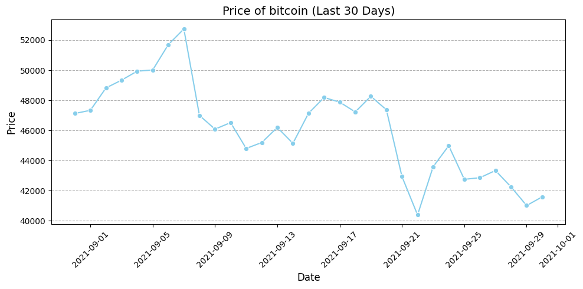
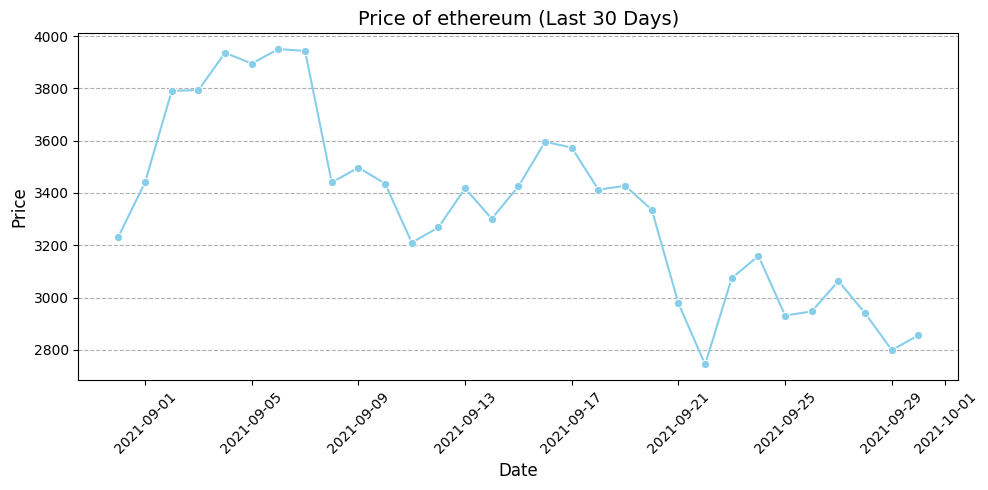
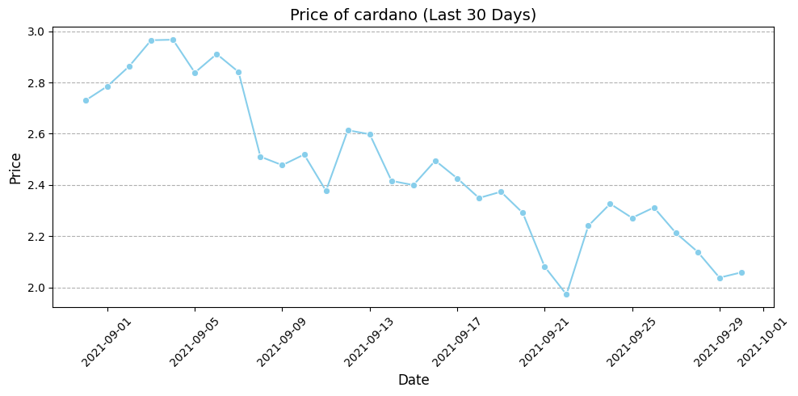

# Crypto Data Fetcher
## Description
Crypto Data Fetcher is a tool that retrieves historical cryptocurrency data from the CoinGecko API and stores it in local files or a PostgreSQL database. It uses asyncio for concurrent requests and retries in case of errors.

## Installation
### Clone the repository:

`git <clone repository-url>`
`cd <repository-name>`

### Create a virtual environment and activate it:
`python -m venv venv`
`source venv/bin/activate`  # On Windows use `venv\Scripts\activate`

### Install the dependencies:
`pip install -r requirements.txt`

### To initialize the environment, create a copy of the template file:
`cd data/`
`cp env-example ../.env`

## Database Setup
### Start the database and Adminer UI:
`docker-compose up -d --build`

Adminer: This setup includes Adminer, a lightweight database management tool in a web browser. This makes it easy to view and manage your PostgreSQL database without needing a separate desktop application. Access Adminer: Once the Docker containers are running, you can access Adminer at http://localhost:8080/.

- Credentials: Use the database credentials specified in your .env file to log in.
- Ensure your database credentials are in the .env file.

## Usage

### Fetch Command
Fetches and saves cryptocurrency data for a specific date.

`python main.py fetch --date YYYY-MM-DD --coin <coin-id> --load-to-db`

- --date: Date in ISO8601 format (e.g., 2017-12-30).
- --coin: Cryptocurrency identifier (e.g., bitcoin).
- --load-to-db: (Optional) Indicates if the data should be loaded into the database.

### Bulk Fetch Command
Fetches and saves cryptocurrency data over a range of dates.

`python main.py bulk_fetch --start-date YYYY-MM-DD --end-date YYYY-MM-DD --coin <coin-id> --concurrent --load-to-db`

- --start-date: Start date in ISO8601 format (e.g., 2017-12-01).
- --end-date: End date in ISO8601 format (e.g., 2017-12-30).
- --coin: Cryptocurrency identifier (e.g., bitcoin).
- --concurrent: (Optional) Enables concurrent fetching.
- --load-to-db: (Optional) Indicates if the data should be loaded into the database.

### CRON Setup for Automated Data Fetching
To automate daily data fetching for bitcoin at 3am, follow these steps:
- Open CRON Tab: Open the crontab for editing or adding new scheduled tasks. In your terminal, execute:
`crontab -e`
- Add CRON Entry: Append the following line at the end of the crontab file to run the application daily at 3am:
`0 3 * * * cd path/project && /path/to/python/executable /path/project/src/main.py bulk_fetch --start-date $(date -d "yesterday" +%Y-%m-%d) --end-date $(date +%Y-%m-%d) --coin bitcoin --concurrent  >> /path/to/your/project/logs/cron.log 2>&1`

## Analysis
Jupyter Notebook
- A folder analysis has been included with a Jupyter Notebook detailing data analysis, feature engineering, and model training for predicting cryptocurrency prices.
- The analysis folder also contains a query.sql file that includes SQL queries for analytical tasks, such as calculating the average price for each coin by month.

- Plot the prices of bitcoin, ethereum and cardano for the last 30 days

## Project Structure
- main.py: Entry point that defines the CLI commands.
- config.py: Loads and manages environment variables.
- logger.py: Configures application logging.
- utils.py: Utility functions and helper classes.
- data_fetcher.py: Class that handles data fetching and storage.
- database.py: Class that manages database connection and operations.